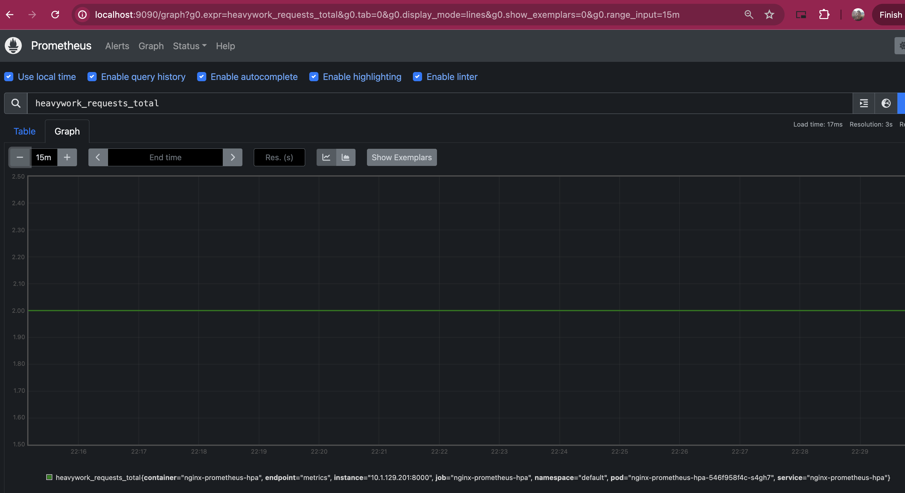
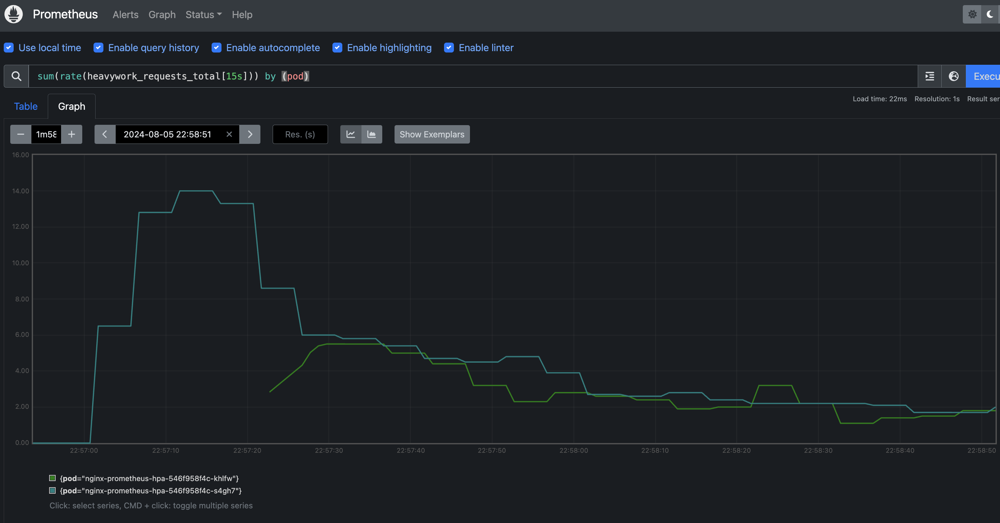
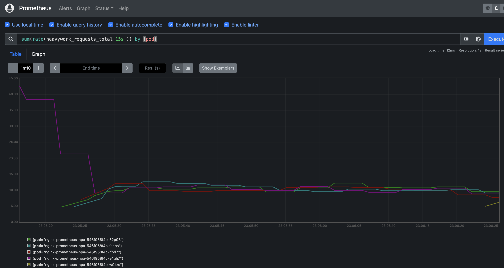
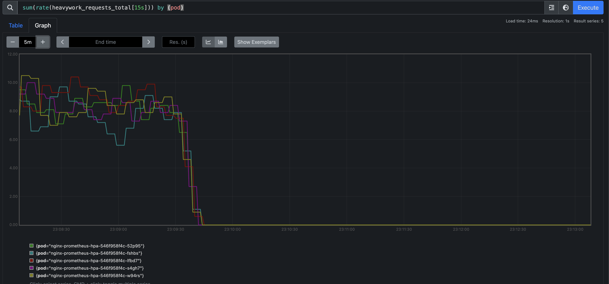

# Kubernetes Custom Metrics for Scaling with HTTP Request

This repository provides a guide and necessary resources to enable Kubernetes custom metrics based on the number of HTTP requests, allowing your application to scale automatically. The steps include exposing metrics, deploying the application using Helm, scraping metrics with Prometheus, setting up Prometheus Adapter, creating a Horizontal Pod Autoscaler (HPA), and generating a load test.

## Table of Contents

1. [Prerequisites](#prerequisites)
2. [Step 1: Enable `/metrics` Endpoint and Expose HTTP Request Count](#step-1-enable-metrics-endpoint-and-expose-http-request-count)
3. [Step 2: Generate Helm Chart to Deploy the Python App with Nginx Controller](#step-2-generate-helm-chart-to-deploy-the-python-app-with-nginx-controller)
4. [Step 3: Create ServiceMonitor to Scrape Metrics with Prometheus](#step-3-create-servicemonitor-to-scrape-metrics-with-prometheus)
5. [Step 4: Install and Setup Prometheus Adapter](#step-4-install-and-setup-prometheus-adapter)
6. [Step 5: Create HPA with Custom Metrics](#step-5-create-hpa-with-custom-metrics)
7. [Step 6: Generate Load Test](#step-6-generate-load-test)
8. [Conclusion](#conclusion)

## Prerequisites

- A functional Kubernetes cluster
- Prometheus and Prometheus Operator installed (kube-prometheus-stack)
- `kubectl` and `helm` CLI tools

## Step 1: Enable `/metrics` Endpoint and Expose HTTP Request Count

In this step, we will:

1. Modify the [Python application](./app/app.py) which receives requests in the routes `/heavywork` and `/lightwork` to add a Counter metric for the `/heavywork` route only.
2. Expose the metrics using the `/metrics` endpoint, compatible with Prometheus.

**Implementation Details:**

- **Metrics Exposure:** Use the library `prometheus_client` to expose metrics. Use the `Counter` method and create the new metric `heavywork_requests_total`

```python
# app/app.py
...
from prometheus_client import Counter, start_http_server
...
c = Counter('heavywork_requests_total', 'Number of heavywork requests')

@app.post('/heavywork')
def heavywork():
    response.status = 202
    c.inc()
    return {"message": "Heavy work started"}
...

if __name__ == "__main__":
    start_http_server(8000)
    app.run(host="0.0.0.0", port=8080)
```

To generate the docker image, we run the following command:

```bash
docker build -t jamorosoa/nginx-prometheus-hpa -f app/Dockerfile
```

## Step 2: Generate Helm Chart to Deploy the Python App with Nginx Controller

1. **Install the Nginx Ingress Controller:** Add the Helm repository and install the chart for the nginx ingress

``` bash
helm install ingress-nginx oci://ghcr.io/nginxinc/charts/nginx-ingress --version 1.3.1
```

2. **Generate the Helm Chart Structure:** Create a Helm chart for the Python application and an Nginx ingress. You can find the chart at [nginx-prometheus-hpa](./nginx-prometheus-hpa/)

3. **Install the Helm Chart:** Deploy the resources in the Chart:

```bash
cd nginx-prometheus-hpa
helm install nginx-prometheus-hpa .
# Validate the ingress was deployed successfully
kubectl describe ingress nginx-prometheus-hpa
```

You should see an output similar to:

```
Name:             nginx-prometheus-hpa
Labels:           app.kubernetes.io/instance=nginx-prometheus-hpa
                  app.kubernetes.io/managed-by=Helm
                  app.kubernetes.io/name=nginx-prometheus-hpa
                  app.kubernetes.io/version=1.16.0
                  helm.sh/chart=nginx-prometheus-hpa-0.1.0
Namespace:        default
Address:          localhost
Ingress Class:    nginx
Default backend:  <default>
Rules:
  Host        Path  Backends
  ----        ----  --------
  localhost   
              /heavywork   nginx-prometheus-hpa:8080 (10.1.129.201:8080)
              /lightwork   nginx-prometheus-hpa:8080 (10.1.129.201:8080)
Annotations:  meta.helm.sh/release-name: nginx-prometheus-hpa
              meta.helm.sh/release-namespace: default
Events:
  Type    Reason          Age   From                      Message
  ----    ------          ----  ----                      -------
  Normal  AddedOrUpdated  26s   nginx-ingress-controller  Configuration for default/nginx-prometheus-hpa was added or updated
```

Now you should be able to make request to the app ingress:

Request to `/heavywork`
```bash
curl -X POST http:localhost/heavywork
```

Output:
```
{"message": "Heavy work started"}
```

Request to `/lightwork`
```bash
curl -X POST http:localhost/lightwork
```

Output:
```
{"message": "Light work done"}
```

## Step 3: Create ServiceMonitor to Scrape Metrics with Prometheus

1. **ServiceMonitor Definition:** Create a `ServiceMonitor` resource to tell Prometheus to scrape the metrics endpoint.
The `ServiceMonitor` is defined in the [svc-monitor.yml](./svc-monitor.yml) file. We the use the label `release=nginx-prometheus-hpa`, because Prometheus was configured to use monitors matching this label only.

2. **Validate ServiceMonitor Setup:** To validate that the `ServiceMonitor` is working properly, we can do a port forwarding to the prometheus service, and validate the metrics are there.

```bash
# Replace the name of the service and port with your corresponding settings
kubectl port-forward svc/kube-prometheus-stack-1721-prometheus 9090:9090 8080:8080
```

Navigate to `localhost:9090` in you browser and search for the `heavywork_requests_total`



## Step 4: Install and Setup Prometheus Adapter

1. **Custom Metrics Rules:** Define rules for Prometheus Adapter to aggregate metrics.

```yaml
# prometheus-adapter/config/metrics.yaml
rules:
  - seriesQuery: heavywork_requests_total
    resources:
        overrides:
        namespace:
            resource: namespace
        pod:
            resource: pod
    name:
        matches: "^(.*)_total"
        as: "${1}_per_second"
    metricsQuery: (sum(rate(<<.Series>>{<<.LabelMatchers>>}[15s])) by (<<.GroupBy>>))
```

Here we are using the metric `heavywork_requests_total`, and converting it to a rate, as we want to measure the frecuency in a specific timeframe. We also, set the metric name to `heavywork_requests_per_second`. This wil be the name for the custom metric that will be exposed on `/apis/custom.metrics.k8s.io/v1beta1`.

The rule is set on the [prometheus-adapter-config.yml](./prometheus-adapter-config.yml) file, and passed during the Prometheus-adapter installation. 

2. **Prometheus Adapter Installation:** Install Prometheus Adapter in your cluster to expose custom metrics.

```bash
helm install prometheus-adapter prometheus-community/prometheus-adapter --values prometheus-adapter-config.yml
```

3. **Validate Prometheus Adapter Setup:** We should now be able to fetch the metric from the `custom.metrics.k8s.io/v1beta1` API.

Run:

```bash
kubectl get --raw "/apis/custom.metrics.k8s.io/v1beta1/namespaces/default/pods/*/heavywork_requests_per_second" | jq .
```

Output:

```json
{
  "kind": "MetricValueList",
  "apiVersion": "custom.metrics.k8s.io/v1beta1",
  "metadata": {},
  "items": [
    {
      "describedObject": {
        "kind": "Pod",
        "namespace": "default",
        "name": "nginx-prometheus-hpa-546f958f4c-s4gh7",
        "apiVersion": "/v1"
      },
      "metricName": "heavywork_requests_per_second",
      "timestamp": "2024-08-06T03:31:46Z",
      "value": "0",
      "selector": null
    }
  ]
}
```

## Step 5: Create HPA with Custom Metrics

1. **Horizontal Pod Autoscaler (HPA):** Create an HPA resource that uses the custom metrics exposed by Prometheus Adapter to scale the application. The metric name is `heavywork_requests_per_second` and the HPA resource can be found at [hpa.yaml](./nginx-prometheus-hpa/templates/hpa.yaml). We use a custom metric of type _Pods_ because the http_request are pods scoped, as the metric comes from each pod. We use a treshold of 10 request per second, to start scaling the replicaset.

```yaml
# hpa.yaml
apiVersion: autoscaling/v2
kind: HorizontalPodAutoscaler
...
    {{- if .Values.autoscaling.httpRequests }}
    - type: Pods
      pods:
        metric:
          name: heavywork_requests_per_second
        target:
          type: AverageValue
          averageValue: {{ .Values.autoscaling.httpRequests }}
    {{- end }}
...
```

## Step 6: Generate Load Test

1. **Load Testing Tool:** To generate load tests, we use the script [generate_load.py](./generate_load.py)

**Example:**
```sh
python3 generate_load.py localhost 80 heavywork
```

We can modify the `arrival_rate`, `decay_rate`, and `duration` for benchmarking purposes. We can also see information like the number of replicas and target by running:

```bash
kubectl get hpa
```

output (initial state with no requests):
```
NAME                   REFERENCE                         TARGETS   MINPODS   MAXPODS   REPLICAS   AGE
nginx-prometheus-hpa   Deployment/nginx-prometheus-hpa   0/10      1         5         1          93m

```

1. For the default values:

```python
arrival_rate = 20
decay_rate = 0.02
duration = 500
```

hpa-describe-output:
```
...
  horizontal-pod-autoscaler  New size: 2; reason: pods metric heavywork_requests_per_second above target
...
```

hpa-get-output:
```
NAME                   REFERENCE                         TARGETS    MINPODS   MAXPODS   REPLICAS   AGE
nginx-prometheus-hpa   Deployment/nginx-prometheus-hpa   2350m/10   1         5         2          96m
```


2. For values:

```python
arrival_rate = 80
decay_rate = 0.001
duration = 500
```

hpa-describe-output:
```
...
  Normal   SuccessfulRescale             2m17s               horizontal-pod-autoscaler  New size: 4; reason: pods metric heavywork_requests_per_second above target
  Normal   SuccessfulRescale             77s                 horizontal-pod-autoscaler  New size: 5; reason:
...
```

hpa-get-output:
```
NAME                   REFERENCE                         TARGETS    MINPODS   MAXPODS   REPLICAS   AGE
nginx-prometheus-hpa   Deployment/nginx-prometheus-hpa   8559m/10   1         5         5          106m
```


On the next image, we can see that as soon as we stop the load-test script, the pods also scale-down to 1.


hpa-describe-output:
```
...
  Normal   SuccessfulRescale  56s (x2 over 12m)  horizontal-pod-autoscaler  New size: 1; reason: All metrics below target
...
```

## Conclusion

This exercise demostrates how we can scale an application by using metrics that are not native in k8s. We also see how the nginx ingress balance the request among the pods to remove the load from one specific pod only.

When we execute the command:

```bash
python3 generate_load.py localhost 80 lightwork
```

We observe no changes in the custom metrics or the hpa, because this route doesn't have a counter, so it's not publishing any metric to prometheus.
